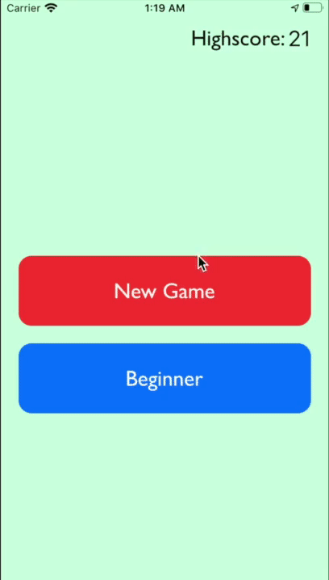

# dropyIos

It is a small  Mobile based IOS application which I made during the recent lockdown.The idea is of a game where you have to hit the figure(which happens to be of the shape of corona virus) before it disappears.With Every hit the score is incremented and it every miss the score is decremented and once the score goes less than zero, it is game over.The level of difficulty change also be chosen from.With more difficulty the appearing time of the shape is less and with less difficulty the appearing time of the shape is more..The programming language used was Swift 4.0, the IDE used was Xcode.

